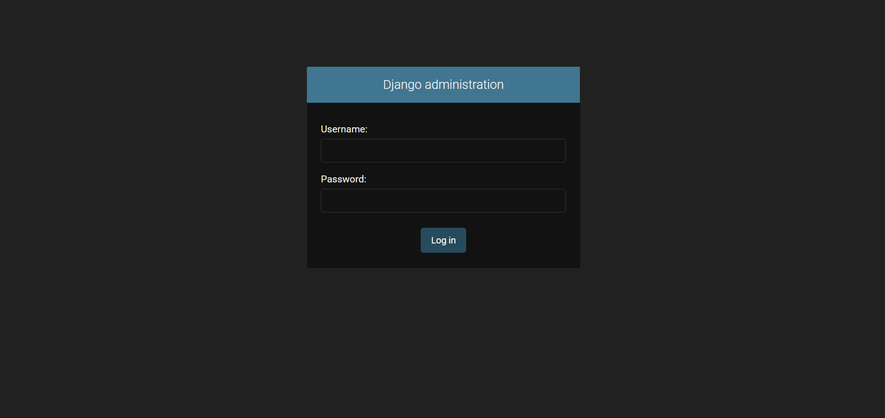
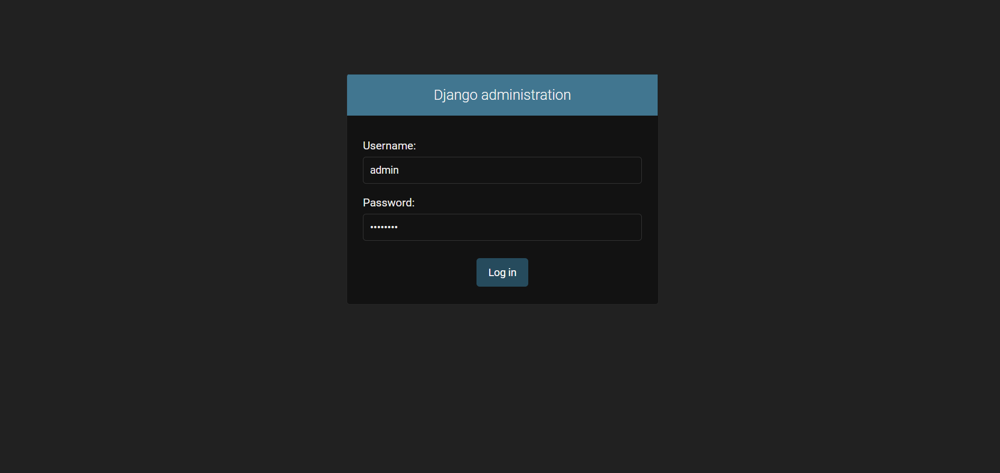
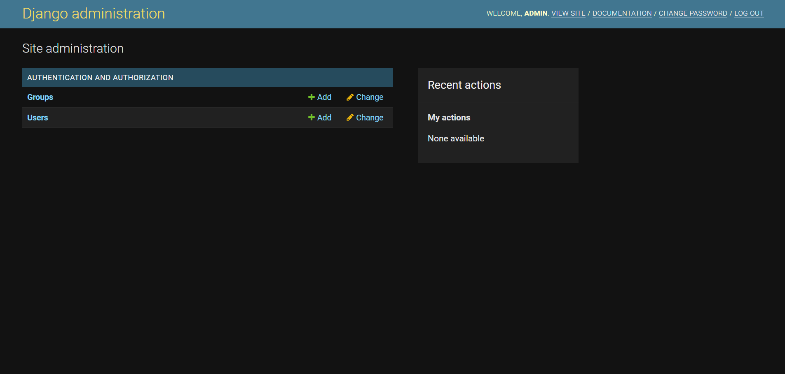

# Create Django Project

1. Start in root directory of project (the directory that will contain all of project code and our `manage.py`):
   * My sample directory:
   * `pwd`

     ```console
     PS C:\Users\FlynntKnapp\Programming\FlynntKnapp-GitHub\01-django-quickstart-project> pw          
     Path
     ----
     C:\Users\FlynntKnapp\Programming\FlynntKnapp-GitHub\01-django-quickstart-projec          
     PS C:\Users\FlynntKnapp\Programming\FlynntKnapp-GitHub\01-django-quickstart-project>
     ```

1. Create virtual environment and install Django and 'docutils' (for Django Admin Documentation):
   * `pipenv install django==4.1.3 docutils==0.19`
   * Sample console output:

     ```console
     PS C:\Users\FlynntKnapp\Programming\FlynntKnapp-GitHub\01-django-quickstart-project> pipenv install django==4.1.3 docutils==0.19
     Creating a virtualenv for this project...
     Pipfile: C:\Users\FlynntKnapp\Programming\FlynntKnapp-GitHub\01-django-quickstart-project\Pipfile
     Using C:/Users/FlynntKnapp/AppData/Local/Programs/Python/Python311/python.exe (3.11.0) to create virtualenv...
     [    ] Creating virtual environment...created virtual environment CPython3.11.0.final.0-64 in 2896ms
       creator Venv(dest=C:\Users\FlynntKnapp\.virtualenvs\01-django-quickstart-project-scwpVQVC, clear=False, no_vcs_ignore=False, global=False, describe=CPython3Windows)
       seeder FromAppData(download=False, pip=bundle, setuptools=bundle, wheel=bundle, via=copy, app_data_dir=C:\Users\FlynntKnapp\AppData\Local\pypa\virtualenv)
         added seed packages: pip==22.3.1, setuptools==65.6.3, wheel==0.38.4
       activators BashActivator,BatchActivator,FishActivator,NushellActivator,PowerShellActivator,PythonActivator
     
     Successfully created virtual environment!
     Virtualenv location: C:\Users\FlynntKnapp\.virtualenvs\01-django-quickstart-project-scwpVQVC
     Creating a Pipfile for this project...
     Installing django==4.1.3...
     Installing docutils==0.19...
     Pipfile.lock not found, creating...
     Locking [packages] dependencies...
     Locking [dev-packages] dependencies...
     Updated Pipfile.lock (a0bcc455ac16f11ccc6fe7c3a7365b0d89cd1d868f94849f91b26998bd569cff)!
     Installing dependencies from Pipfile.lock (569cff)...
     To activate this project's virtualenv, run pipenv shell.
     Alternatively, run a command inside the virtualenv with pipenv run.
     PS C:\Users\FlynntKnapp\Programming\FlynntKnapp-GitHub\01-django-quickstart-project>
     ```

1. Activate virtual environment:
    * `pipenv shell`
    * Sample console output:

      ```console
      PS C:\Users\FlynntKnapp\Programming\FlynntKnapp-GitHub\01-django-quickstart-project> pipenv shell
      Launching subshell in virtual environment...
      PowerShell 7.3.1
      PS C:\Users\FlynntKnapp\Programming\FlynntKnapp-GitHub\01-django-quickstart-project>
      ```

1. Verify that Django and 'docutils' are installed:
    * `pip list`
    * Sample console output:

      ```console
      PS C:\Users\FlynntKnapp\Programming\FlynntKnapp-GitHub\01-django-quickstart-project> pip list
      Package    Version
      ---------- -------
      asgiref    3.5.2
      Django     4.1.3
      docutils   0.19
      pip        22.3.1
      setuptools 65.6.3
      sqlparse   0.4.3
      tzdata     2022.7
      wheel      0.38.4
      PS C:\Users\FlynntKnapp\Programming\FlynntKnapp-GitHub\01-django-quickstart-project>
      ```

1. Create Django project:
    * `django-admin startproject config .`
    * Sample console output:

      ```console
      PS C:\Users\FlynntKnapp\Programming\FlynntKnapp-GitHub\01-django-quickstart-project> django-admin startproject config .
      PS C:\Users\FlynntKnapp\Programming\FlynntKnapp-GitHub\01-django-quickstart-project>
      ```

    * Note: The `.` at the end of the command tells Django to create the project in the current directory.

1. Test development server:
    * `python manage.py runserver`
    * Sample console output:

      ```console
      PS C:\Users\FlynntKnapp\Programming\FlynntKnapp-GitHub\01-django-quickstart-project> python manage.py runserver
      Watching for file changes with StatReloader
      Performing system checks...
      
      System check identified no issues (0 silenced).
      
      You have 18 unapplied migration(s). Your project may not work properly until you apply the migrations for app(s): admin, auth, contenttypes, sessions.
      Run 'python manage.py migrate' to apply them.
      December 16, 2022 - 10:42:38
      Django version 4.1.3, using settings 'config.settings'
      Starting development server at http://127.0.0.1:8000/
      Quit the server with CTRL-BREAK.
      ```

    * Note: The development server is running on port 8000 by default.  You can change the port by adding the port number to the end of the command, e.g. `python manage.py runserver 8010`.

1. Open the development server URL in a browser:
    * <http://localhost:8000/>
    * Sample browser image:
        
    * Sample console output:

      ```console
      [16/Dec/2022 10:44:22] "GET / HTTP/1.1" 200 10681
      [16/Dec/2022 10:44:22] "GET /static/admin/css/fonts.css HTTP/1.1" 200 423
      [16/Dec/2022 10:44:22] "GET /static/admin/fonts/Roboto-Regular-webfont.woff HTTP/1.1" 200 85876
      [16/Dec/2022 10:44:22] "GET /static/admin/fonts/Roboto-Bold-webfont.woff HTTP/1.1" 200 86184
      [16/Dec/2022 10:44:22] "GET /static/admin/fonts/Roboto-Light-webfont.woff HTTP/1.1" 200 85692
      Not Found: /favicon.ico
      [16/Dec/2022 10:44:22] "GET /favicon.ico HTTP/1.1" 404 2110
      ```

1. Stop the development server:
    * `Ctrl+C`

1. Add `django.contrib`'s `admindocs` app to `INSTALLED_APPS` list in [`config/settings.py`](../config/settings.py):

    ```python
    INSTALLED_APPS = [
        #...
        'django.contrib.admindocs',
        #...
    ]
    ```

1. Add URL path for `admindocs` app to `urlpatterns` list in [`config/urls.py`](../config/urls.py):

    NOTE: Make sure to add the `admindocs` URL path **before**/**above** the `admin` URL path.

    ```python
    urlpatterns = [
        #...
        path('admin/doc/', include('django.contrib.admindocs.urls')),
        #...
    ]
    ```

1. For the above URL `path` to function properly, we need to import `include` from `django.urls` in [`config/urls.py`](../config/urls.py):

    1. Add import of `include` to the import line of `path`:

        ```python
        #...
        from django.urls import path, include
        #...
        ```

1. Create the database by using `migrate`. This will allow us to create a superuser in next step:
    * `python manage.py migrate`

      ```console
      PS C:\Users\FlynntKnapp\Programming\01-django-quickstart-project> python manage.py migrate
      Operations to perform:
        Apply all migrations: admin, auth, contenttypes, sessions
      Running migrations:
        Applying contenttypes.0001_initial... OK
        Applying auth.0001_initial... OK
        Applying admin.0001_initial... OK
        Applying admin.0002_logentry_remove_auto_add... OK
        Applying admin.0003_logentry_add_action_flag_choices... OK
        Applying contenttypes.0002_remove_content_type_name... OK
        Applying auth.0002_alter_permission_name_max_length... OK
        Applying auth.0003_alter_user_email_max_length... OK
        Applying auth.0004_alter_user_username_opts... OK
        Applying auth.0005_alter_user_last_login_null... OK
        Applying auth.0006_require_contenttypes_0002... OK
        Applying auth.0007_alter_validators_add_error_messages... OK
        Applying auth.0008_alter_user_username_max_length... OK
        Applying auth.0009_alter_user_last_name_max_length... OK
        Applying auth.0010_alter_group_name_max_length... OK
        Applying auth.0011_update_proxy_permissions... OK
        Applying auth.0012_alter_user_first_name_max_length... OK
        Applying sessions.0001_initial... OK
      PS C:\Users\FlynntKnapp\Programming\01-django-quickstart-project>
      ```

1. Create a superuser so we can log into Django Admin Interface and access Django Admin Documentation:

    NOTE: The superuser will be created with the username and password you specify.

    IMPORTANT: Never use `admin` as the username for an application in production.

    IMPORTANT: Never use weak passwords for an application in production.

    * `python manage.py createsuperuser --email admin@email.app --username admin`

      ```console
      PS C:\Users\FlynntKnapp\Programming\01-django-quickstart-project> python manage.py createsuperuser --email admin@email.app --username admin
      Password: 
      Password (again):
      This password is too common.
      Bypass password validation and create user anyway? [y/N]: y
      Superuser created successfully.
      PS C:\Users\FlynntKnapp\Programming\01-django-quickstart-project>
      ```

1. Start the development server:
    * `python manage.py runserver`
    * Sample console output:

      ```console
      PS C:\Users\FlynntKnapp\Programming\01-django-quickstart-project> python manage.py runserver
      Watching for file changes with StatReloader
      Performing system checks...

      System check identified no issues (0 silenced).
      December 18, 2022 - 07:56:40
      Django version 4.1.3, using settings 'config.settings'
      Starting development server at http://127.0.0.1:8000/
      Quit the server with CTRL-BREAK.
      ```

1. Open the Django Admin Interface URL in a browser:
    * <http://localhost:8000/admin/>
    * Sample browser image:
        
    * Sample console output:

      ```console
      [18/Dec/2022 08:00:29] "GET /admin/ HTTP/1.1" 302 0
      [18/Dec/2022 08:00:29] "GET /admin/login/?next=/admin/ HTTP/1.1" 200 2218
      ```

1. Log into the Django Admin Interface using credentials created for the superuser above.
    * Sample browser image:
        

1. Click the `Log in` button.
    * Sample browser image:
        
    * Sample console output:

      ```console
      [18/Dec/2022 08:05:42] "POST /admin/login/?next=/admin/ HTTP/1.1" 302 0
      [18/Dec/2022 08:05:42] "GET /admin/ HTTP/1.1" 200 3667
      ```
